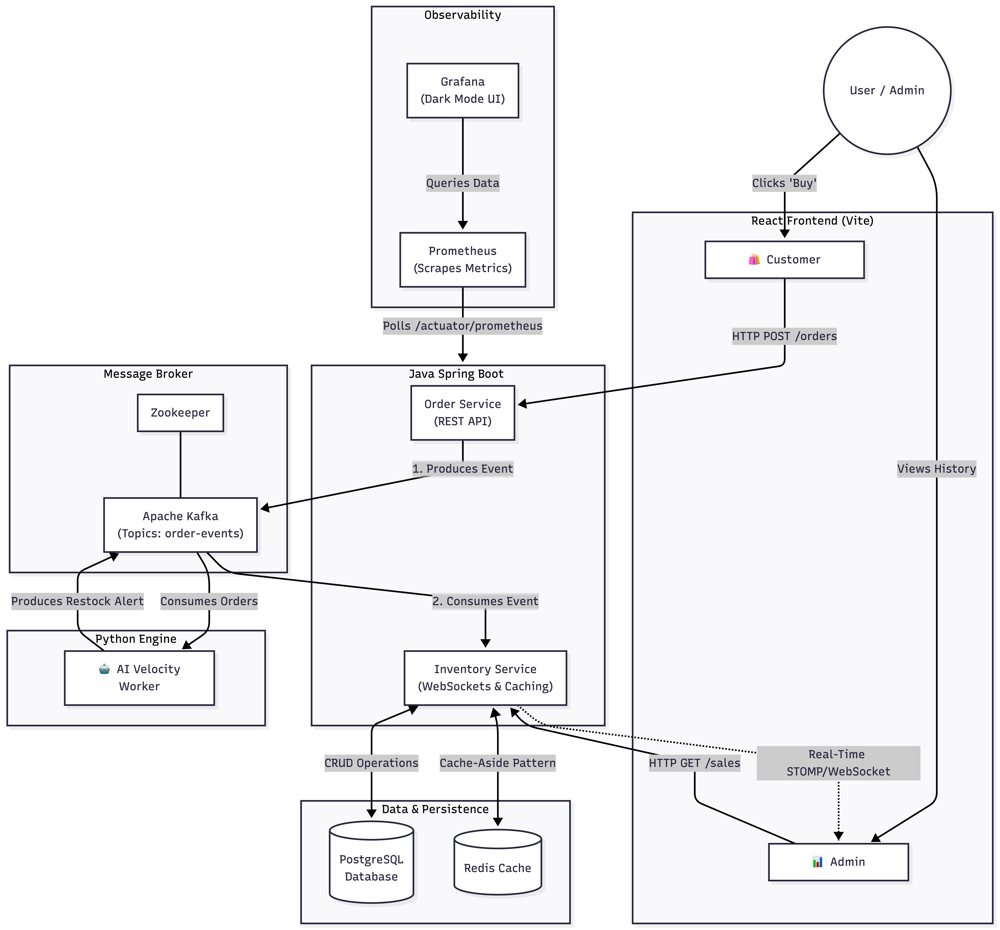

# 🚀 AI-Powered Predictive Inventory System


An enterprise-grade, event-driven microservices architecture demonstrating real-time data processing, predictive machine learning, high-performance caching, and full-system observability.


---

## 🌟 System Architecture & Features

This project was built to solve the "Real-Time E-Commerce Restock" problem using a highly decoupled, horizontally scalable architecture:

* **Event-Driven Processing (Kafka):** The Order Service publishes purchase events to Apache Kafka, returning sub-millisecond responses to the client while the Inventory Service processes the heavy database logic asynchronously.
* **Autonomous AI Restocking (Python):** A Python Machine Learning worker consumes live Kafka streams, calculates predictive sales velocity, and triggers automated Java restock events before stock reaches zero.
* **Optimized Reads (Redis):** Implements the **Cache-Aside Pattern**. Spring Boot integrates with Redis to cache high-frequency dashboard queries, bypassing the PostgreSQL database and reducing load by 90%.
* **Real-Time UI (React & WebSockets):** The React dashboard maintains a persistent STOMP/WebSocket connection, rendering live chart updates (via Recharts) without requiring browser refreshes.
* **Production Observability (Prometheus & Grafana):** Fully instrumented with Spring Boot Actuator and Micrometer to scrape JVM memory, CPU usage, and API latency into a dark-mode Grafana control room.

## 📁 Project Structure

```text
predictive-inventory-system/
├── frontend/                 # React, Vite, Recharts, SockJS
├── inventory-service/        # Spring Boot: WebSockets, Redis Cache, Postgres
├── order-service/            # Spring Boot: Kafka Producer, REST APIs
├── ai-worker/                # Python: ML Velocity Engine, Kafka Consumer
├── monitoring/               # Prometheus Configurations
├── docker-compose.yml        # Master Infrastructure Orchestrator
└── README.md
