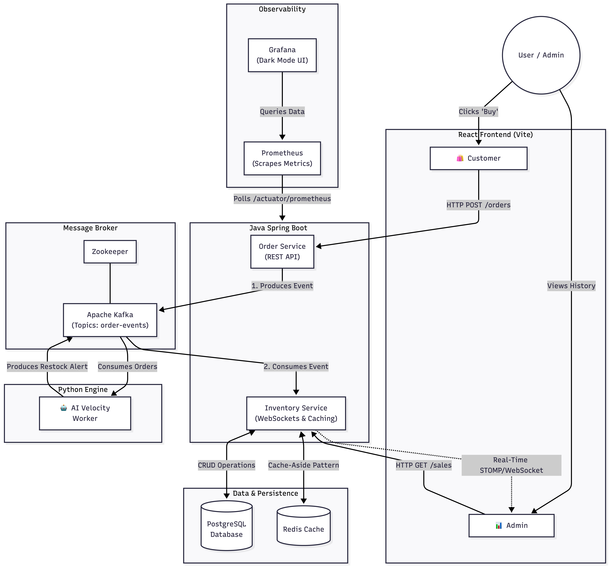
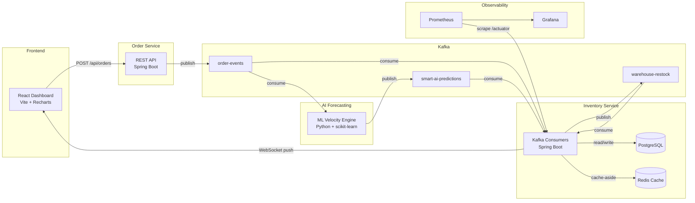

# AI-Powered Predictive Inventory System


An enterprise-grade, event-driven microservices platform that predicts product stock depletion using real-time machine learning and triggers autonomous restocking before items run out.



---

## Architecture


```mermaid
graph LR
    subgraph Frontend
        A[React Dashboard<br/>Vite + Recharts]
    end

    subgraph Order Service
        B[REST API<br/>Spring Boot]
    end

    subgraph Kafka
        K1[order-events]
        K2[smart-ai-predictions]
        K3[warehouse-restock]
    end

    subgraph Inventory Service
        C[Kafka Consumers<br/>Spring Boot]
        D[(PostgreSQL)]
        E[(Redis Cache)]
    end

    subgraph AI Forecasting
        F[ML Velocity Engine<br/>Python + scikit-learn]
    end

    subgraph Observability
        G[Prometheus]
        H[Grafana]
    end

    A -->|POST /api/orders| B
    B -->|publish| K1
    K1 -->|consume| C
    K1 -->|consume| F
    C -->|read/write| D
    C -->|cache-aside| E
    C -->|WebSocket push| A
    F -->|publish| K2
    K2 -->|consume| C
    C -->|publish| K3
    K3 -->|consume| C
    G -->|scrape /actuator| C
    G --> H
```

## Key Features

| Feature | Implementation |
|---|---|
| **Event-Driven Processing** | Order Service publishes to Kafka; Inventory Service consumes asynchronously for sub-millisecond API responses |
| **Autonomous AI Restocking** | Per-SKU linear regression models predict sales velocity; emergency restocks trigger automatically when depletion < 10 mins |
| **Cache-Aside Pattern** | Redis caches high-frequency dashboard queries, evicted on writes to ensure consistency |
| **Real-Time Dashboard** | STOMP/WebSocket connection pushes live inventory updates and AI predictions to React without polling |
| **Production Observability** | Spring Boot Actuator + Micrometer expose JVM and API metrics to Prometheus/Grafana |
| **Containerized Deployment** | Multi-stage Docker builds for all services; single-command orchestration via Docker Compose |

## Project Structure

```
predictive-inventory-system/
├── order-service/               # Spring Boot — REST API, Kafka producer
│   ├── controller/              #   Order endpoint with input validation
│   ├── service/                 #   Kafka event publishing
│   └── Dockerfile
├── inventory-service/           # Spring Boot — Event consumers, WebSocket, Redis
│   ├── controller/              #   REST API for dashboard queries
│   ├── service/                 #   Business logic, caching, predictions
│   ├── listener/                #   Kafka consumers (orders, AI, restock)
│   ├── exception/               #   Custom exceptions + global handler
│   └── Dockerfile
├── ai-forecasting-service/      # Python — Per-SKU ML velocity engine
│   ├── brain.py                 #   Kafka consumer + scikit-learn models
│   ├── test_brain.py            #   pytest test suite
│   └── Dockerfile
├── frontend/                    # React + Vite + Recharts + SockJS
├── monitoring/                  # Prometheus scrape configuration
├── .github/workflows/ci.yml    # GitHub Actions CI pipeline
└── docker-compose.yml           # Full-stack orchestration
```

## Getting Started

### Prerequisites

- Docker & Docker Compose
- Java 17+ (for local development)
- Node.js 20+ (for frontend development)
- Python 3.11+ (for AI service development)

### Run Everything with Docker

```bash
# Clone the repository
git clone https://github.com/vedgharat/predictive-inventory-system.git
cd predictive-inventory-system

# Start all services
docker compose up --build

# Services will be available at:
#   Frontend:           http://localhost:5173
#   Order Service API:  http://localhost:8081
#   Inventory API:      http://localhost:8082
#   Grafana:            http://localhost:3001
#   Prometheus:         http://localhost:9090
#   RedisInsight:       http://localhost:8001
```

### Run Locally (Development)

```bash
# 1. Start infrastructure only
docker compose up postgres kafka zookeeper redis prometheus grafana

# 2. Start backend services (in separate terminals)
cd order-service && ./mvnw spring-boot:run
cd inventory-service && ./mvnw spring-boot:run

# 3. Start AI service
cd ai-forecasting-service
pip install -r requirements.txt
python brain.py

# 4. Start frontend
cd frontend
npm install && npm run dev
```

## API Reference

### Order Service (`:8081`)

| Method | Endpoint | Params | Description |
|--------|----------|--------|-------------|
| `POST` | `/api/orders/place` | `sku` (string), `quantity` (int ≥ 1) | Place an order (async via Kafka) |

### Inventory Service (`:8082`)

| Method | Endpoint | Description |
|--------|----------|-------------|
| `GET` | `/api/inventory` | List all inventory items |
| `GET` | `/api/inventory/{sku}` | Get item by SKU with depletion estimate |
| `GET` | `/api/inventory/sales` | Recent sales history (Redis-cached) |
| `WS` | `/ws` → `/topic/inventory` | Real-time inventory updates |
| `WS` | `/ws` → `/topic/ai-predictions` | Real-time AI velocity predictions |

## Running Tests

```bash
# Java services
cd inventory-service && ./mvnw test
cd order-service && ./mvnw test

# AI service
cd ai-forecasting-service && pytest test_brain.py -v

# Frontend
cd frontend && npm run lint
```

## Tech Stack Deep Dive

- **Spring Boot 4** — REST APIs, Kafka integration, WebSocket, JPA, Redis caching
- **Apache Kafka** — Async event streaming across 3 topics with consumer groups
- **PostgreSQL** — Persistent inventory and sales history storage
- **Redis** — Cache-Aside pattern with `@Cacheable` / `@CacheEvict`
- **scikit-learn** — Per-SKU LinearRegression models for velocity prediction
- **React 19 + Vite** — Real-time dashboard with Recharts and STOMP WebSockets
- **Prometheus + Grafana** — JVM metrics, API latency, and system health monitoring
- **Docker** — Multi-stage builds, health checks, compose orchestration
- **GitHub Actions** — CI pipeline for build, test, lint, and Docker verification
